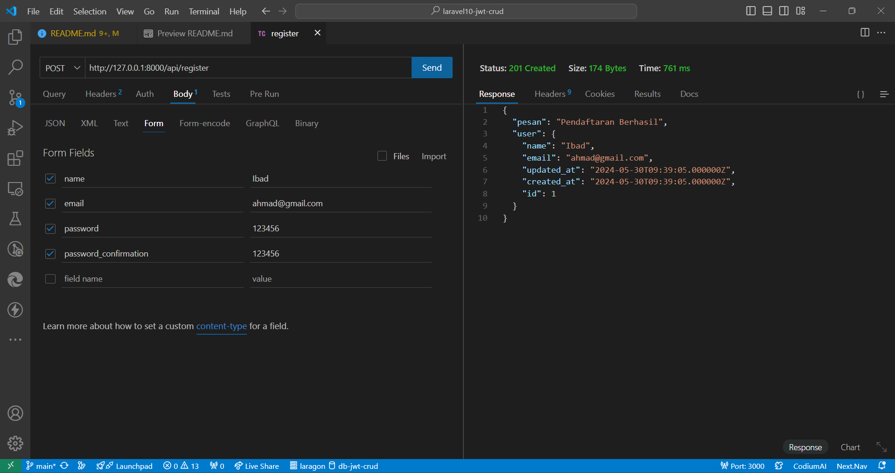
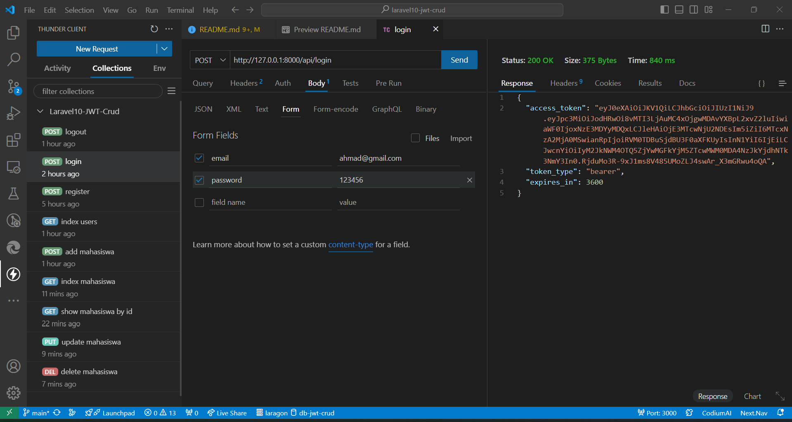
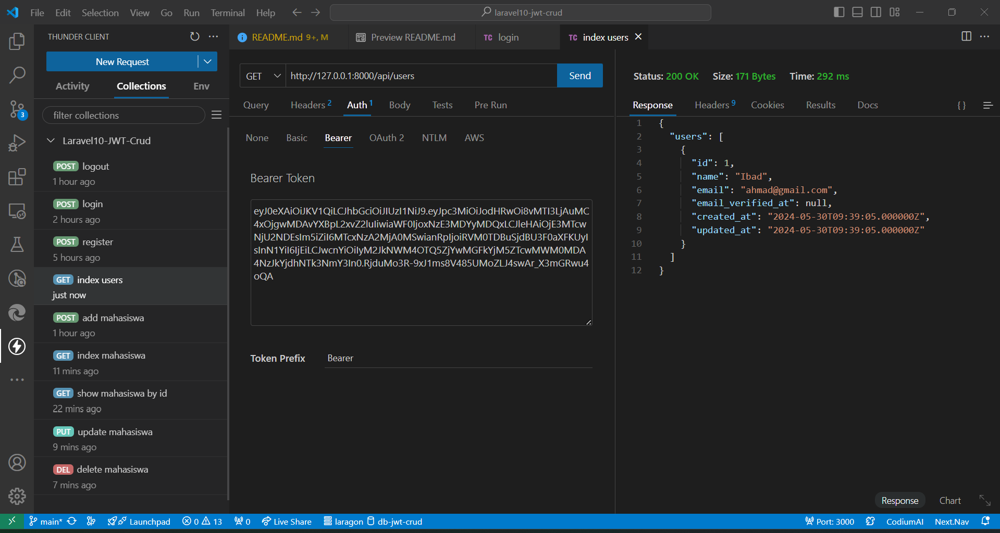
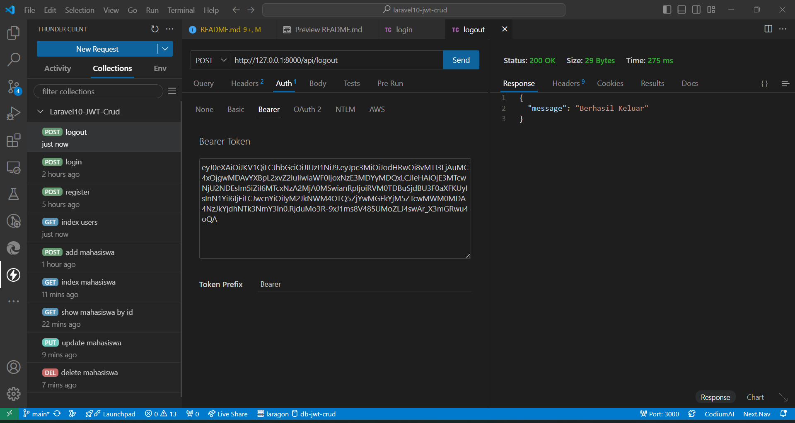
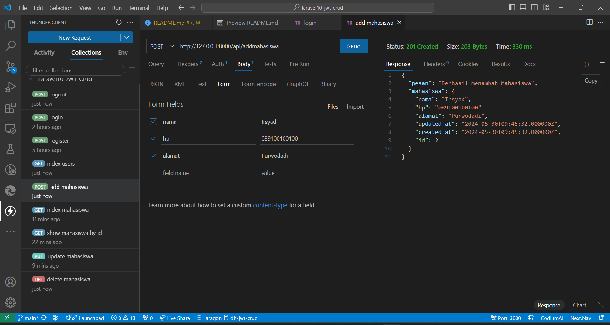
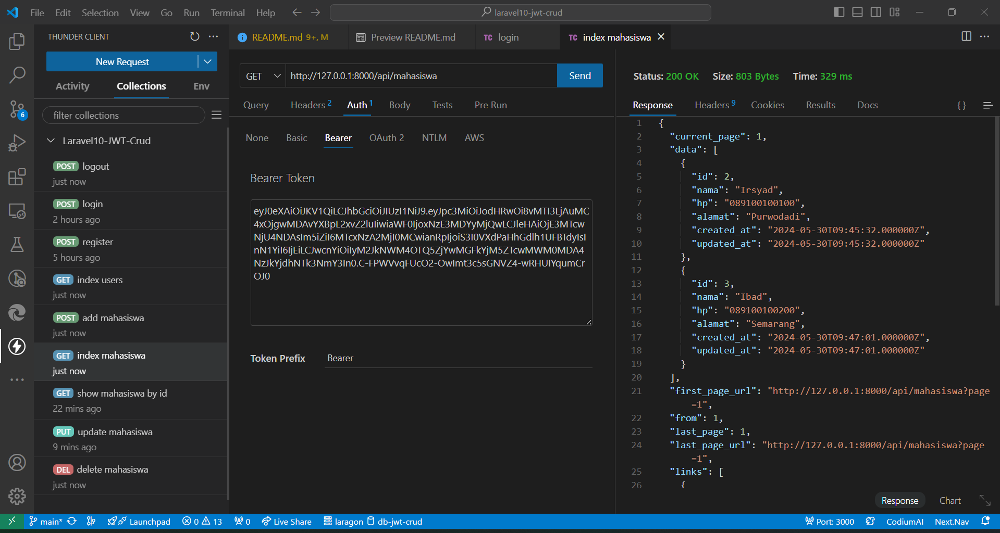
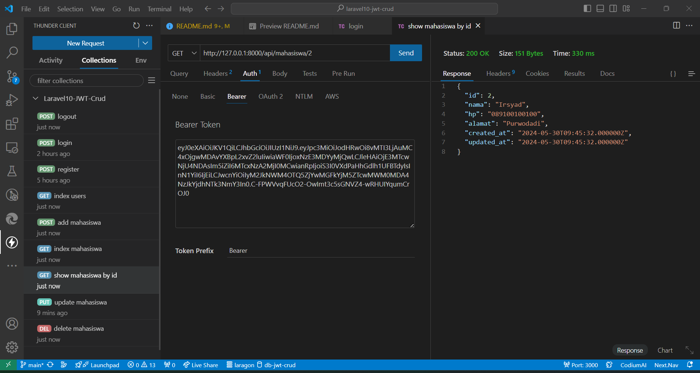
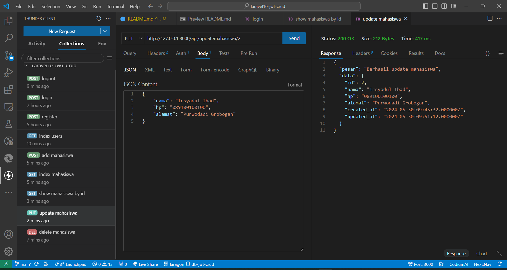
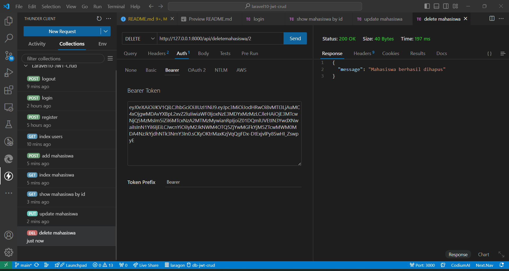

# Project Laravel 10 JWT AUTH + CRUD

## Hasil Uji Coba API menggunakan Thunder Client

### Register Users:

### Login Users:

### Index Users:

### Logout:

### Add Mahasiswa:

### Index Mahasiswa:

### Show Mahasiswa by ID:

### Update Mahasiswa:

### Delete Mahasiswa:

## About Laravel

Laravel is a web application framework with expressive, elegant syntax. We believe development must be an enjoyable and creative experience to be truly fulfilling. Laravel takes the pain out of development by easing common tasks used in many web projects, such as:

- [Simple, fast routing engine](https://laravel.com/docs/routing).
- [Powerful dependency injection container](https://laravel.com/docs/container).
- Multiple back-ends for [session](https://laravel.com/docs/session) and [cache](https://laravel.com/docs/cache) storage.
- Expressive, intuitive [database ORM](https://laravel.com/docs/eloquent).
- Database agnostic [schema migrations](https://laravel.com/docs/migrations).
- [Robust background job processing](https://laravel.com/docs/queues).
- [Real-time event broadcasting](https://laravel.com/docs/broadcasting).

Laravel is accessible, powerful, and provides tools required for large, robust applications.
